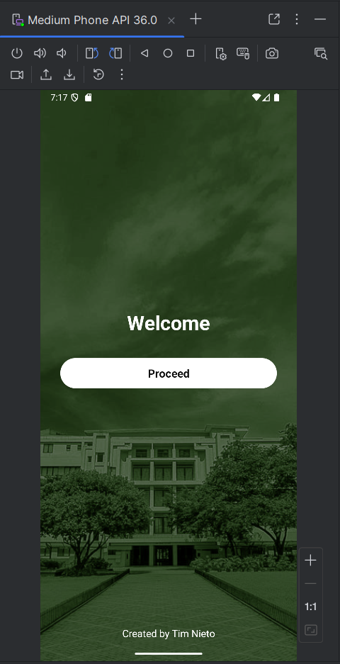
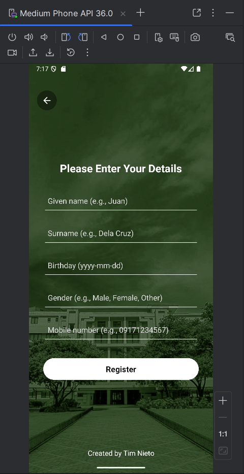
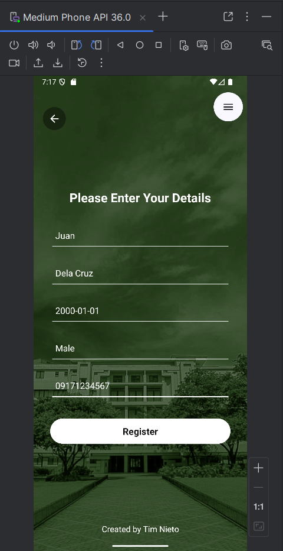
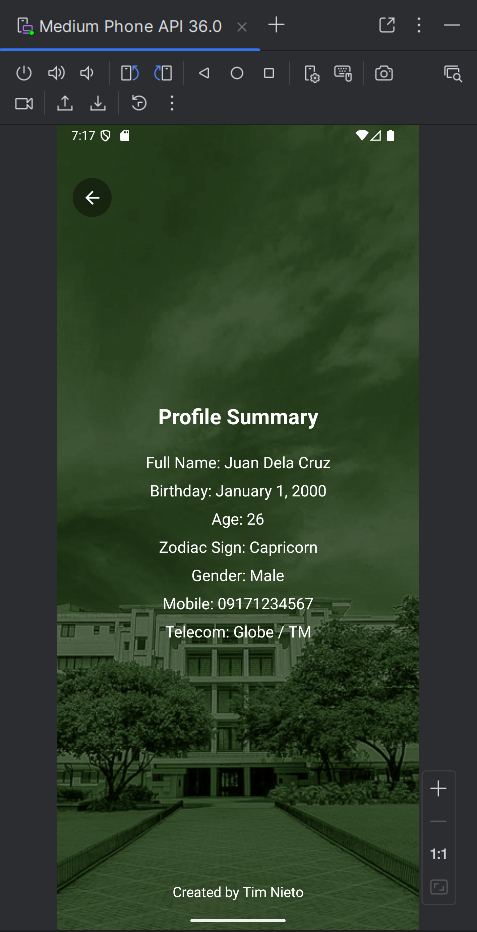
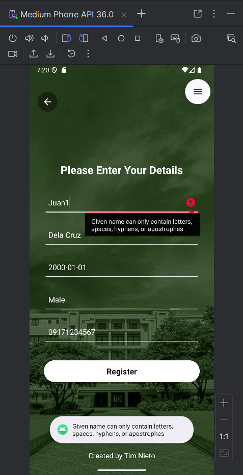

# Android Profile Registration App

An Android profile registration app built with Java and Android Studio. The app collects user details, validates input, calculates age and zodiac sign, and identifies the mobile telecom network based on the phone number prefix.

## Overview

Android Profile Registration App is a mobile application that demonstrates form handling, input validation, multi-screen navigation, and data passing between Android activities.

The app includes a welcome screen, a registration form, and a profile summary screen. It was cleaned and organized for public portfolio use with stronger backend validation, consistent UI styling, and clear project structure.

## Features

- Welcome screen with Proceed navigation
- Registration form for user profile details
- Strict input validation
- Field-level error messages
- Toast validation messages
- Back button navigation
- Profile summary screen
- Age calculation from birthday
- Zodiac sign detection
- Mobile telecom network detection
- Multi-activity navigation using Intents
- Clean Java code structure
- Consistent XML UI styling

## Technologies Used

- Java
- Android Studio
- Android SDK
- Gradle
- XML Layouts
- Material Android Theme

## Screens

The app contains three main screens:

1. Welcome screen
2. Registration form screen
3. Profile summary screen

## Input Validation

The registration form validates all user inputs before showing the result screen.

| Field | Validation |
|---|---|
| Given Name | Required, 2-40 characters, letters only with spaces, hyphens, or apostrophes |
| Surname | Required, 2-40 characters, letters only with spaces, hyphens, or apostrophes |
| Birthday | Required, exact `yyyy-mm-dd` format, valid date, not future, year must be 1900 or later |
| Gender | Required, must be `Male`, `Female`, `Other`, or `Prefer not to say` |
| Mobile Number | Required, exactly 11 digits, starts with `09` or `08`, must match a known Philippine mobile prefix |

## Sample Valid Input

```text
Given name: Juan
Surname: Dela Cruz
Birthday: 2000-01-01
Gender: Male
Mobile number: 09171234567
```

Expected output:

```text
Full Name: Juan Dela Cruz
Birthday: January 1, 2000
Age: 26
Zodiac Sign: Capricorn
Gender: Male
Mobile: 09171234567
Telecom: Globe / TM
```

## Project Structure

```text
android-profile-registration-app/
├── app/
│   ├── src/
│   │   └── main/
│   │       ├── java/
│   │       │   └── com/
│   │       │       └── timnieto/
│   │       │           └── profileregistration/
│   │       │               ├── MainActivity.java
│   │       │               ├── RegisterActivity.java
│   │       │               └── ResultActivity.java
│   │       ├── res/
│   │       │   ├── drawable/
│   │       │   │   ├── back_button_background.xml
│   │       │   │   ├── bg_app.jpg
│   │       │   │   ├── ic_back_arrow.xml
│   │       │   │   ├── ic_launcher_background.xml
│   │       │   │   └── ic_launcher_foreground.xml
│   │       │   ├── layout/
│   │       │   │   ├── activity_main.xml
│   │       │   │   ├── activity_register.xml
│   │       │   │   └── activity_result.xml
│   │       │   └── values/
│   │       │       ├── colors.xml
│   │       │       ├── dimens.xml
│   │       │       ├── strings.xml
│   │       │       ├── styles.xml
│   │       │       └── themes.xml
│   │       └── AndroidManifest.xml
│   └── build.gradle.kts
├── assets/
│   ├── sample-output.png
│   ├── sample-output2.png
│   ├── sample-output3.png
│   ├── sample-output4.png
│   └── sample-output5.png
├── build.gradle.kts
├── settings.gradle.kts
└── README.md
```

## Screenshots

### Welcome Screen



### Registration Form with Input Examples



### Filled Valid Registration Form



### Profile Summary Result



### Invalid Input Validation



## How to Run

1. Clone the repository:

```bash
git clone https://github.com/TimNieto/android-profile-registration-app.git
cd android-profile-registration-app
```

2. Open the project in Android Studio.

3. Let Android Studio sync the Gradle files.

4. Start an Android emulator or connect an Android device.

5. Run the app from Android Studio, or use the command line.

## Build Command

On Windows PowerShell:

```powershell
.\gradlew clean assembleDebug
```

Expected output:

```text
BUILD SUCCESSFUL
```

## Install Command

```powershell
.\gradlew installDebug
```

## Functionality Test Cases

| Test Case | Input | Expected Result |
|---|---|---|
| Valid registration | Juan, Dela Cruz, 2000-01-01, Male, 09171234567 | Opens profile summary |
| Invalid given name | Juan1 | Rejected |
| Invalid surname | Dela@ | Rejected |
| Invalid birthday format | 2000-1-1 | Rejected |
| Future birthday | 2028-01-01 | Rejected |
| Invalid birth year | 1899-01-01 | Rejected |
| Invalid gender | Boy | Rejected |
| Invalid mobile length | 12345 | Rejected |
| Invalid mobile prefix | 07171234567 | Rejected |

## Code Notes

The main app logic is separated across three activities:

- `MainActivity.java` handles the welcome screen and navigation to the registration form.
- `RegisterActivity.java` handles user input, strict validation, and passing valid data to the result screen.
- `ResultActivity.java` displays the profile summary and calculates age, zodiac sign, and telecom network.

## OOP Concepts Used

- Encapsulation through private fields and helper methods
- Separation of responsibilities across multiple activity classes
- Constants for reusable keys, validation values, and known mobile prefixes
- Method-based organization for validation, formatting, and navigation logic

## Database Notes

This project does not use a database. User input is passed between activities using Android Intent extras.

## Future Improvements

- Replace the gender text field with a dropdown selector
- Add a date picker for birthday input
- Add more complete telecom prefix coverage
- Add unit tests for validation and profile calculations
- Add landscape layout support
- Add saved profile history

## License

This project is for educational and portfolio purposes only. All rights are reserved.

You may view the source code, but you may not copy, modify, distribute, or use this code without permission from the author.

## Author

Created by Tim Nieto.
